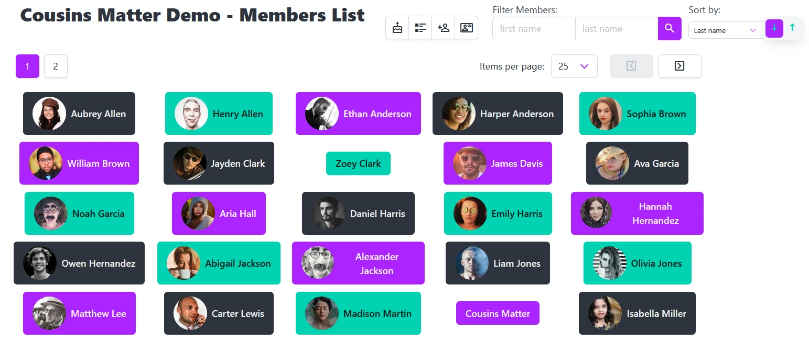
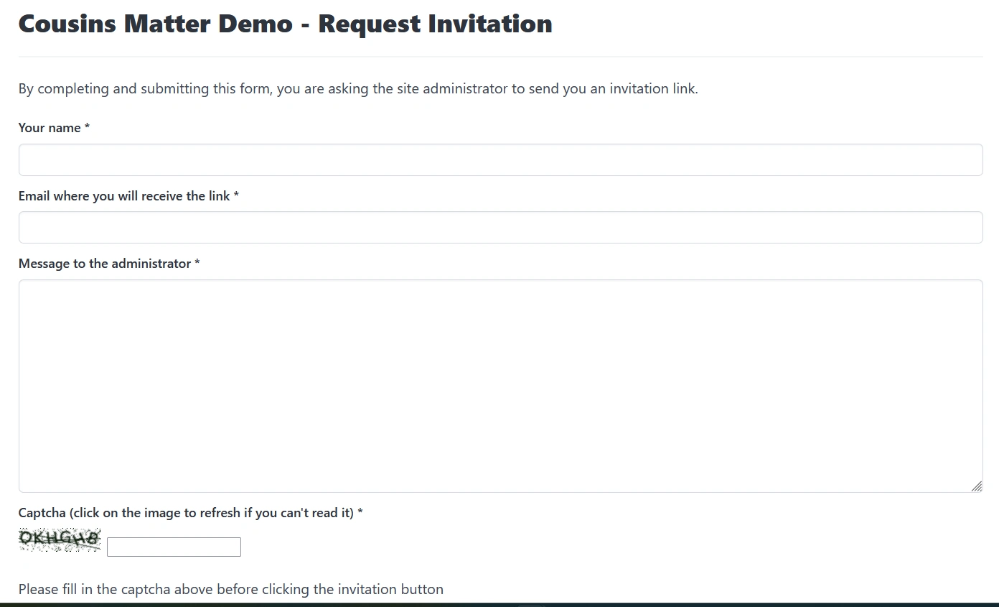
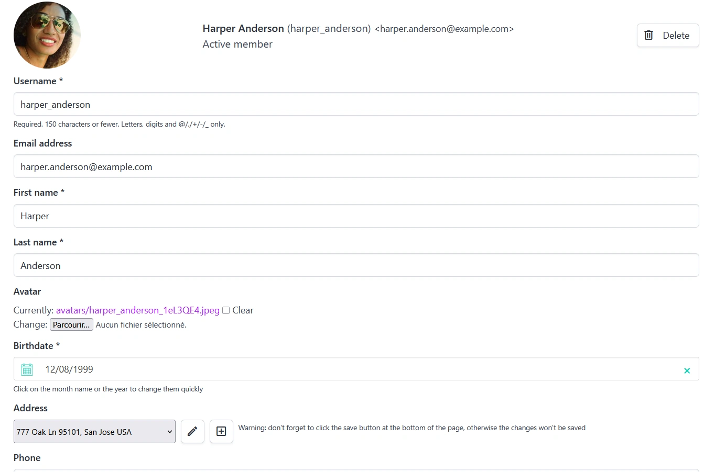
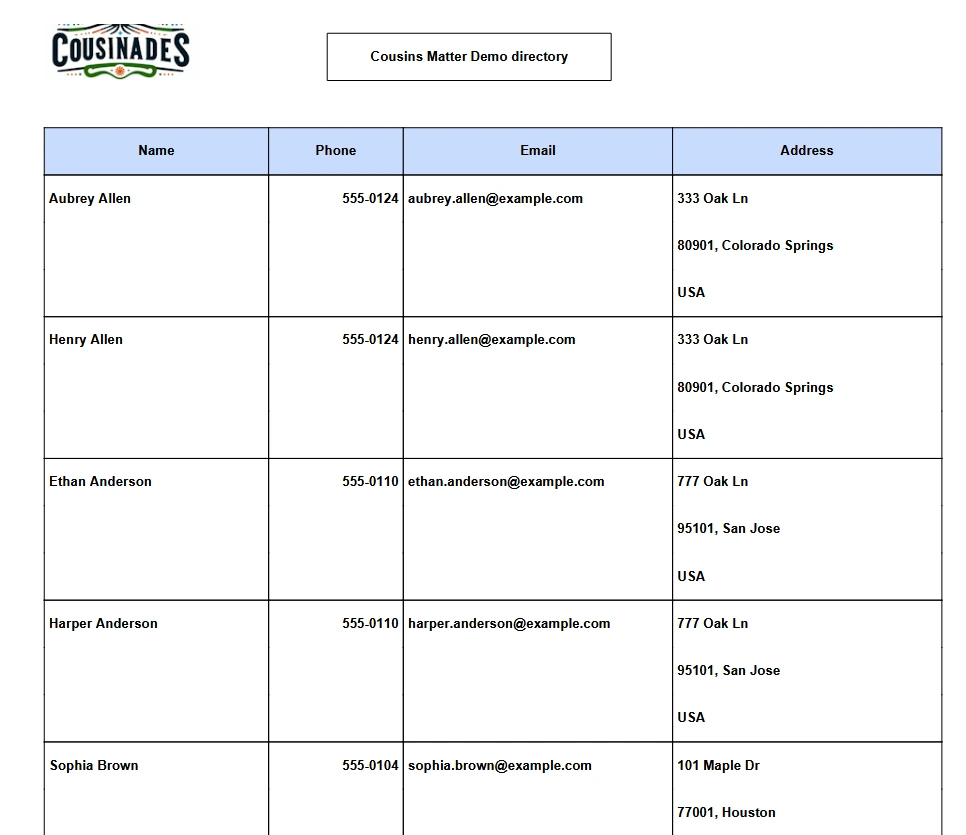
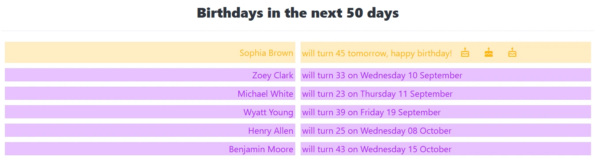

## Features

### Member Management

* Members can be listed, filtered by first and last name and sorted

	

* Site admin or any member (depending on settings) can invite other members by email

	

* Anyone can request an invitation which will be emailed to the site admin who can then invite them. Invitation requests are protected by a captcha.

	

* Members can create "managed" members, i.e. members who are not active on the site (e.g. for small children or elderly people)
* Managed members can be activated by their managing members (e.g. when a child is old enough to be active on the site).
* Members can be imported in bulk via CSV files
* Members can update their own profile and the profile of the members they manage

	

* A directory of members can be printed in PDF format

	

* Birthdays in the next 50 days can be displayed (50 can be changed in settings)

	

### Galleries

* All active members can create galleries and add photos to them
* Galleries can have sub galleries of any depth
* Photos can be imported in bulk using zip files. Each folder in the zip file becomes a gallery. Updates are managed
* Gallery photo display is paginated

### Forum

* Active members can create posts
* Active members can reply to other members' posts or add simple comments

### Chat

* Connected members can chat in live mode with other connected members
* Cousins Matter manages as many chat rooms as requested
* Members can create private chat rooms and select the members who can participate in these rooms. 
	The creator of the room becomes admin in this room and can add other members and elect admins in these members.
	Admins can invite other members and other admins

### Pages / CMS

Basic CMS features: admins can create static HTML pages and publish them on the site. 
The home page can also be configured this way as well as the privcay policy, the about pages... 

### Troves

This is a place where you can put the focus on numeric family treasures, be it texts, music, videos

### Polls

Any active member can create a poll and any active member can answer an active poll.
Polls have publication and closure dates. They can contains multiple questions and questions can be either

* simple yes/no questions: tick the check box
* open text: enter whatever rich text you want
* date: pick a date
* choices: pick a choice in a list

### Event planning

As a sub module of the Poll module, any active member can create an event planning survey to define when an avent should take place. This adds to the Poll module the following kinds of choices:

* choose one date in a provided list
* choose several dates in a provided list

### Classified ads

Any active member can publish a classified ad that can be seen by all other members. If a memeber is interested in an ad, s.he can send a message to the ad publisher who will receive an email.
