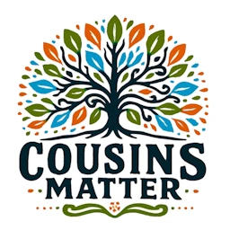

#  COUSINS MATTER!

## What is Cousins Matter?
Cousins Matter is a web application designed to help you manage large family trees. It allows you to list your cousins, aunts, uncles, siblings, childrens and ancestors and gives them the option to manage their own profiles. The app also provides various useful features, such as:

* photo galleries, 
* forums, 
* chat rooms,
* polls
* classified ads
* ...

It can also be used to manage small communities (i.e. no more than a few hundred people), such as sports clubs and gaming clubs.

In order to run this application, you will require a small server on which a recent version of Docker has been installed. This could be a Raspberry Pi 4 or 5, an old PC or a small virtual private server (VPS). The application will run comfortably on 2 vCPUs and 2 GB of RAM, and the disk size is only important for storing photos (and, in the near future, even more for videos).

This site contains all the documentation related to installing and managing the application.

## Migrate from Version 1 to Version 2
The version 2 of Cousins Matter is a big rewrite of the version 1. It is not directly compatible with the version 1. To migrate from version 1 to version 2, please follow the instructions in the [migrate from v1 to v2 version of Cousins Matter](migrate-from-v1-to-v2.md) page.

## Authors
The main developer of Cousins Matter is [@leolivier](https://www.github.com/leolivier)

