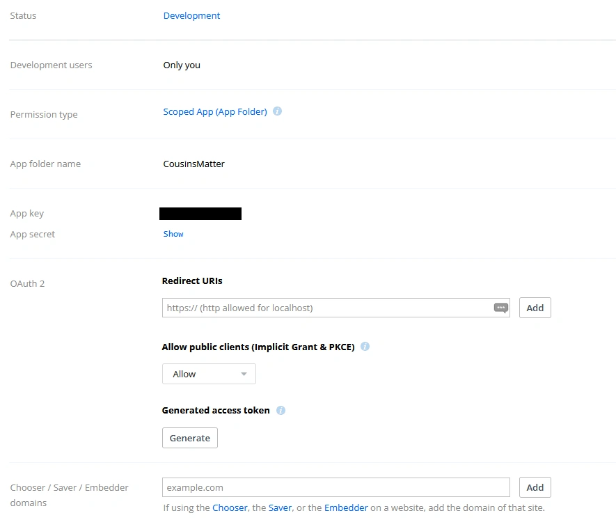
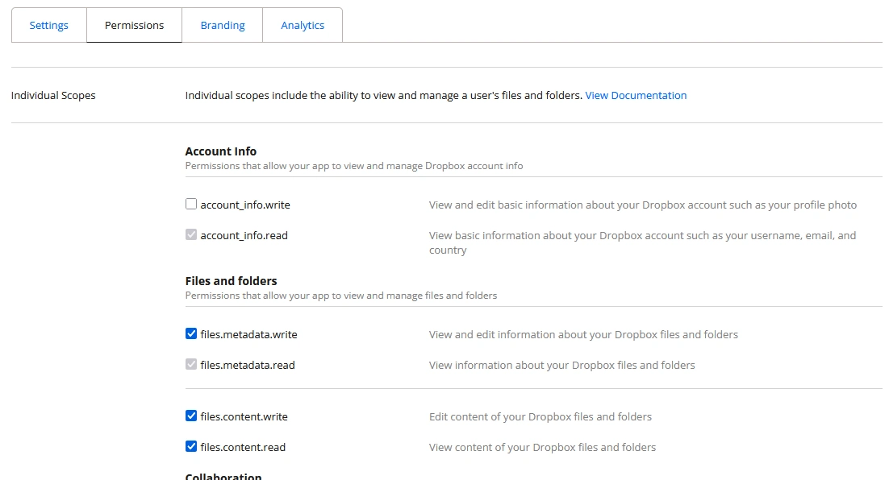

# CURRENTLY ONLY S3 SUPPORTED, DROPBOX DOESN'T WORK (PROBABLY AN ISSUE INSIDE DJANGO-STORAGES FOR DROPBOX)


# Media Storage

## WARNINGS 

* __This is currently a <span class="blinking-text"><u>BETA</u></span> feature!__
* __These settings are more complex and are <u>reserved for advanced users</u>.__

## Default media storage
By default, the media are stored in the 'media' sub directory in the same file system as the Cousins Matter.

This is very simple but it has some drawbacks, especially on the security side as explained in [this article](https://security.googleblog.com/2012/08/content-hosting-for-modern-web.html)

## Other media storages

Cousins Matter also supports a bunch of other media storages by using the 'django-storages' package. To setup such a storage, you just need to define two new variables in your .env file: MEDIA_STORAGE and MEDIA_STORAGE_OPTIONS.

The media storages supported by django-storages at the time of writing this page are: 

* Amazon S3
* Apache Libcloud
* Azure Storage
* Dropbox
* FTP
* Google Cloud Storage
* SFTP
* S3 Compatible
	* Backblaze B2
	* Cloudflare R2
	* Digital Ocean
	* Oracle Cloud
	* Scaleway

**Only the Dropbox storage and the Cloudflare R2 storage have been tested and experimented as of now** but all other storages should work as long as you find the right setup. See [Other S3 compatible storages](#other-s3-compatible-storages) and [Non tested storages](#non-tested-storages) below.

If you manage to create a working setup for non tested storages, please create a Pull Request on GitHub on this file to explain how it works.

### Cloudflare R2

To use Cloudflare R2, you obviously first need to [create an account on Cloudflare](https://developers.cloudflare.com/fundamentals/account/create-account/).

Then, you must [create an S3 bucket on Cloudflare R2 - Dashbord tab](https://developers.cloudflare.com/r2/data-catalog/get-started/#1-create-an-r2-bucket). Remember the bucket name.

You also need to [create an application token](https://developers.cloudflare.com/r2/api/tokens/). Remember the access key, secret key and endpoint urls on the last page when your API token is created.

Once this is done, the setup in your .env file should look like this:
```
MEDIA_STORAGE=storages.backends.s3.S3Storage
MEDIA_STORAGE_OPTIONS='{"access_key":"<your access key>","secret_key":"<your secret key>","bucket_name":"<your bucket name>","endpoint_url":"https://<your account id>.r2.cloudflarestorage.com"}'
```
Then restart Cousins Matter: `docker compose restart cousins-matter`

#### Other S3 compatible storages

The setup for other S3 compatible storages (including AWS S3, the original one) should be close to the R2 one but has not yet been tested.
As all these backend share the same implementation, you don't need to create your own image as described for [non tested storages](#non-tested-storages) below.
Have a look at [django-storages documentation](https://django-storages.readthedocs.io/en/latest/index.html) to see which specific variables should be set in the options for your particular case.

### Dropbox

You will need to have a Dropbox account to use this storage (see https://www.dropbox.com/register).
Then, you will need to [create an application](https://www.dropbox.com/developers/apps). The Settings form should look like this:
. Remember the app key and the app secret.
Got to the Permissions tab and fill the form like this:

Don't forget to click on Submit at the end...

Then, as described on the [Django-storages Dropbox page](https://django-storages.readthedocs.io/en/latest/backends/dropbox.html), get your authorization code, then, using this code, obtain the access_token (starting with "sl.") and the refresh token.

Once this is done, the setup in your .env file should look like this:

```
MEDIA_STORAGE=storages.backends.dropbox.DropboxStorage
MEDIA_STORAGE_OPTIONS='{"app_key":"<your app key>","app_secret":"<your app secret>","root_path":"/","oauth2_access_token":"<your access token>","oauth2_refresh_token":"<your refresh token>"}'
```

## Non tested storages

### Install needed Python package

**Note:** This is not needed for all S3 compatible backends, see above [Other S3 compatible storages](#other-s3-compatible-storages)

First, you need to install a specific python package that implement the link to your backend. 

See the page related to your backend in the [django-storages documentation](https://django-storages.readthedocs.io/en/latest/index.html) to see the name of your package which should appear like `pip install django-storages[<backend name>]`. Remember the value of `<backend name>`, you will use it to replace it below.

There are to ways to install this package, use the method that suits you the best...

* Either you create your own image of Cousins Matter deriving from the official one like this:
	1. create a Dockerfile this way:

		```
		FROM ghcr.io/leolivier/cousins-matter:latest
		RUN pip install django-storages[<backend name>]
		```

	1. build the new image (change the image tag as you like):

		```
		docker build -t cousins-matter:local .
		```

	1. set COUSINS_MATTER_IMAGE in your .env file to refer to `cousins-matter:local` (or your tag if you changed it)
	1. recreate the containers

		```
		docker compose up -d --force-recreate cousins-matter qcluster
		```

	You will have to rebuild the image and recreate the containers each time a new version is delivered.

* Or you update the running containers like this:

	```
	docker exec -it cousins-matter pip install django-storages[<backend name>]
	docker exec -it cousins-matter.qcluster pip install django-storages[<backend name>]
	```

	You will have to execute these 2 commands each time your containers are updated with a new official image.

__WARNING__: in some cases, there are more than one package to install. For instance, if you use Azure Storage with Managed Identity, you will need to install another package for Managed Identity. Proceed as described above and just add the other package names at the end of the `pip install` command line

### Create the setup

Have a look at the setups above for [Dropbox](#dropbox) and [Cloudflare R2](#cloudflare-r2) to understand how the 2 variables MEDIA_STORAGE and MEDIA_STORAGE_OPTIONS work and see the [django-storages documentation](https://django-storages.readthedocs.io/en/latest/index.html) for your backend to adapt these setups to your case.

MEDIA_STORAGE must be taken from the page of your backend. Use the value of BACKEND in the STORAGES block (e.g. storages.backends.azure_storage.AzureStorage for the Azure Storage backend).

MEDIA_STORAGE_OPTIONS must stay on one line. It has the following format (the order of quotes and double quotes is important!)

```
MEDIA_STORAGE_OPTIONS='{"option1":"value1","option2":"value2",...}'
```

Replace option1, option2 by the lower case variables described in the documentation and their values for your case.

## Migration from the media directory to an external storage

__TIP__: if you have already saved a lot of files in your media directory, using [rclone](https://rclone.org/install/) is a time saver to migrate your files to your new backend. First create a config for your backend (`rclone config`), then copy your media files: `rclone copy ./media <your backend>:<your root>`
