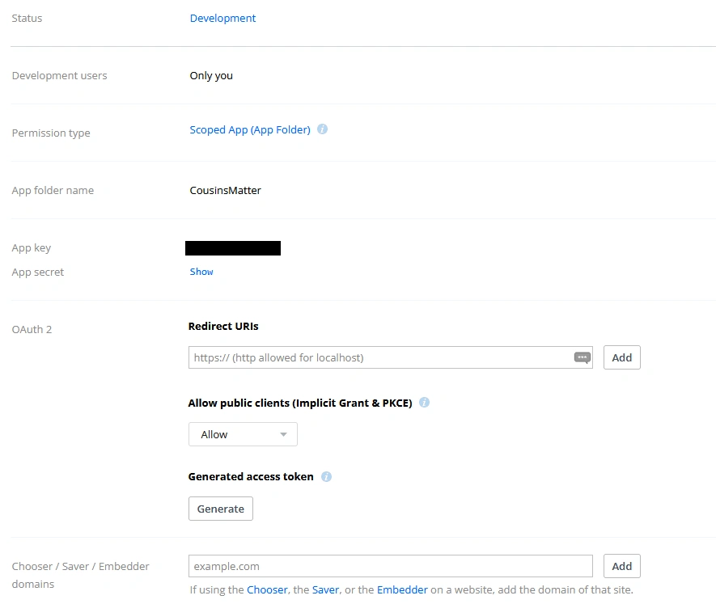
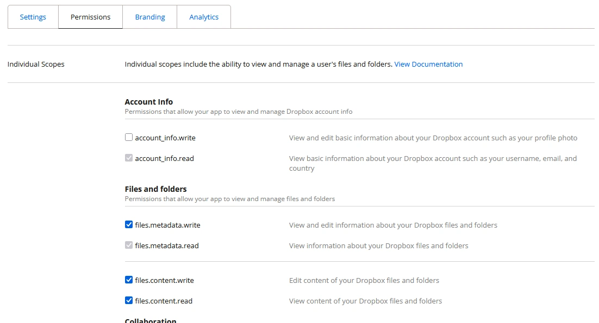

# Media Storage

## Default media storage
By default, the media are stored in the 'media' sub directory in the same file system as the Cousins Matter.

This is very simple but it has some drawbacks, especially on the security side as explained in [this article](https://security.googleblog.com/2012/08/content-hosting-for-modern-web.html)

## Other media storages
Cousins Matter also supports a bunch of other media storages by using the 'django-storages' package. To setup such a storage, you just need to define two new variables in your .env file: MEDIA_STORAGE and MEDIA_STORAGE_OPTIONS.

__WARNING__: these settings are for more advanced users...

The media storages supported by django-storages at the time of writing this page are: 

* Amazon S3
* Apache Libcloud
* Azure Storage
* Dropbox
* FTP
* Google Cloud Storage
* SFTP
* S3 Compatible
	* Backblaze B2
	* Cloudflare R2
	* Digital Ocean
	* Oracle Cloud
	* Scaleway

Only the Dropbox storage and the Cloudflare R2 storage have been tested and experimented as of now but all other storages should work as long as you find the right setup. Have a look at the setups below to understand how it works and see the [django-storages documentation](https://django-storages.readthedocs.io/en/latest/index.html) to adapt it to your backend. 

If you manage to create a working setup for non tested storages, please create a Pull Request on GitHub on this file to explain how it works.

### Cloudflare R2
To use Cloudflare R2, you obviously first need to [create an account on Cloudflare](https://developers.cloudflare.com/fundamentals/account/create-account/).

Then, you must [create an S3 bucket on Cloudflare R2 - Dashbord tab](https://developers.cloudflare.com/r2/data-catalog/get-started/#1-create-an-r2-bucket). Remember the bucket name.

You also need to [create an application token](https://developers.cloudflare.com/r2/api/tokens/). Remember the access key, secret key and endpoint urls on the last page when your API token is created.

Once this is done, the setup in your .env file should look like this:
```
MEDIA_STORAGE=storages.backends.s3.S3Storage
MEDIA_STORAGE_OPTIONS='{"access_key":"<your access key>","secret_key":"<your secret key>","bucket_name":"<your bucket name>","endpoint_url":"https://<your account id>.r2.cloudflarestorage.com"}'
```
Then restart Cousins Matter: `docker compose restart cousins-matter`

#### Other S3 compatible storages
The setup for other S3 compatible storages (including AWS S3, the original one) should be close to the R2 one but has not yet been tested.
Have a look at [django-storages documentation](https://django-storages.readthedocs.io/en/latest/index.html) to see which specific variables should be set in the options for your particular case.

### Dropox
You will need to have a Dropbox account to use this storage (see https://www.dropbox.com/register).
Then, you will need to [create an application](https://www.dropbox.com/developers/apps). The Settings form should look like this:
. Remember the app key and the app secret.
Got to the Permissions tab and fill the form like this:

Don't forget to click on Submit at the end...

Then, as described on the [Django-storages Dropbox page](https://django-storages.readthedocs.io/en/latest/backends/dropbox.html), get your authorization code, then, using this code, obtain the access_token (starting with "sl.") and the refresh token.

Once this is done, the setup in your .env file should look like this:
```
MEDIA_STORAGE=storages.backends.dropbox.DropboxStorage
MEDIA_STORAGE_OPTIONS='{"app_key":"<your app key>","app_secret":"<your app secret>","root_path":"/","oauth2_access_token":"<your access token>","oauth2_refresh_token":"<your refresh token>"}'
```

## Migration from the media directory to an external storage

__TIP__: if you have already saved a lot of files in your media directory, using [rclone](https://rclone.org/install/) is a time saver to migrate your files to your new backend. First create a config for your backend (`rclone config`), then copy your media files: `rclone copy ./media <your backend>:<your root>`
